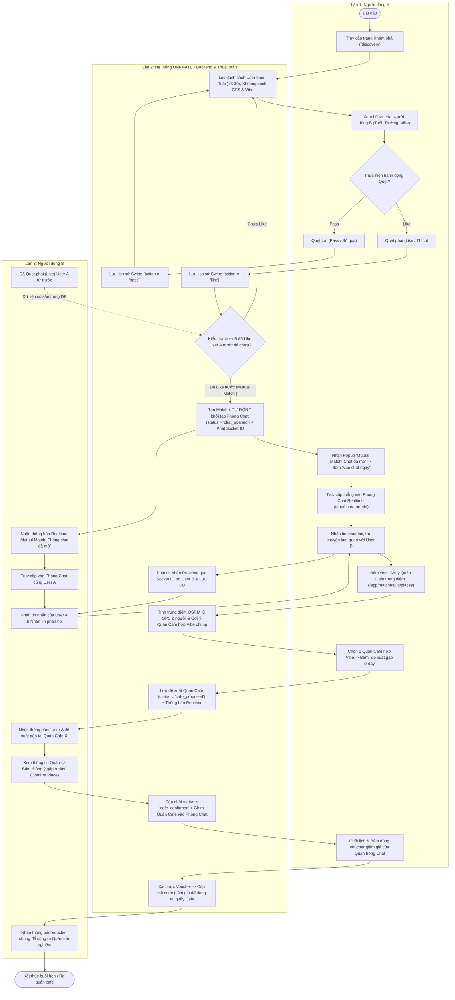
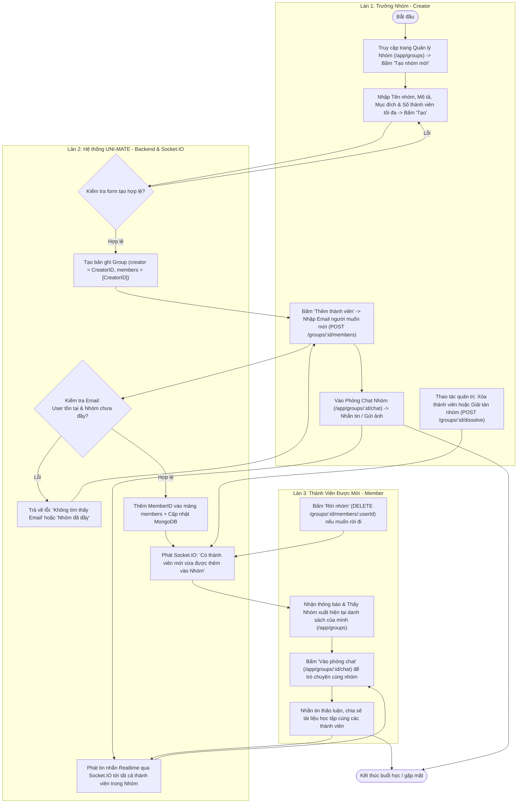
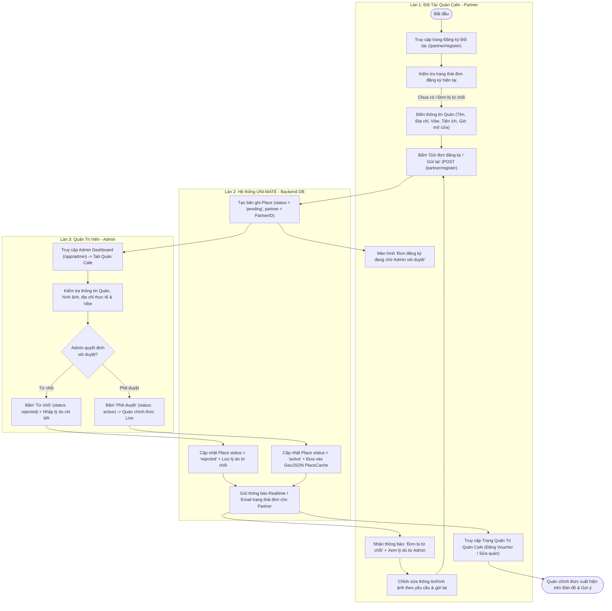
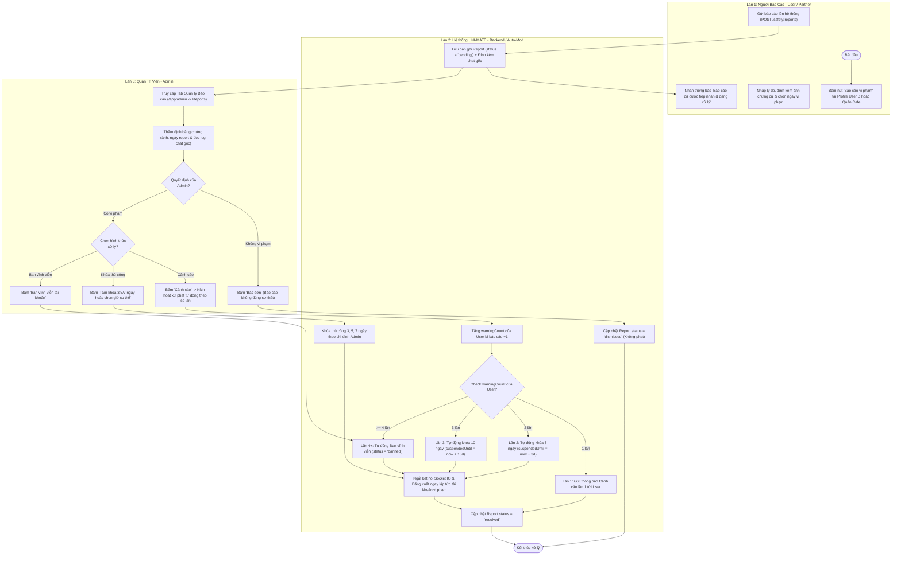

# Sơ đồ Activity Diagram: Discovery ➔ Matching ➔ Chatting (Swimlane 3 làn)

---

# 2. Sơ đồ Activity Diagram: Nhóm Học Tập & Trò Chuyện Nhóm (Swimlane 3 làn)
> Giai đoạn: Trưởng Nhóm Tạo Nhóm ➔ Mời Thành Viên bằng Email ➔ Trò Chuyện Nhóm Realtime (`Group Chat`)

---

# 3. Sơ đồ Activity Diagram: Đăng Ký Quán Cafe & Kiểm Duyệt Admin (Swimlane 3 làn)
> Giai đoạn: Partner Gửi Đơn ➔ Admin Kiểm Duyệt ➔ Phê Duyệt hoặc Từ Chối (`rejected status`)

---

# 4. Sơ đồ Activity Diagram: Báo Cáo Vi Phạm & Xử Phạt Tự Động (Swimlane 3 làn)
> Giai đoạn: Gửi Báo Cáo (Report) ➔ Admin Thẩm Định ➔ Tự Động Khóa 3-5-7 Ngày / Ban (`suspendedUntil`)

