# Sơ đồ tuần tự UML — Luồng thực tế UNI-MATE

Tài liệu này được dựng từ frontend, route, controller, service, Socket.IO handler và Mongoose model hiện tại.

Quy ước lifeline theo UML robustness:

- `«boundary»`: màn hình/giao diện mà actor tương tác.
- `«control»`: controller hoặc service điều phối nghiệp vụ.
- `«entity»`: model/domain object được đọc hoặc thay đổi.
- Mũi tên liền: lời gọi; mũi tên đứt: dữ liệu/kết quả trả về.
- Khung `alt`, `opt`, `loop`, `par`: các combined fragment của UML.

## SD-01 — Đăng ký tài khoản

Luồng thật: đăng ký không xác thực OTP; backend tạo `User` với `emailVerified=true` và cấp token ngay.

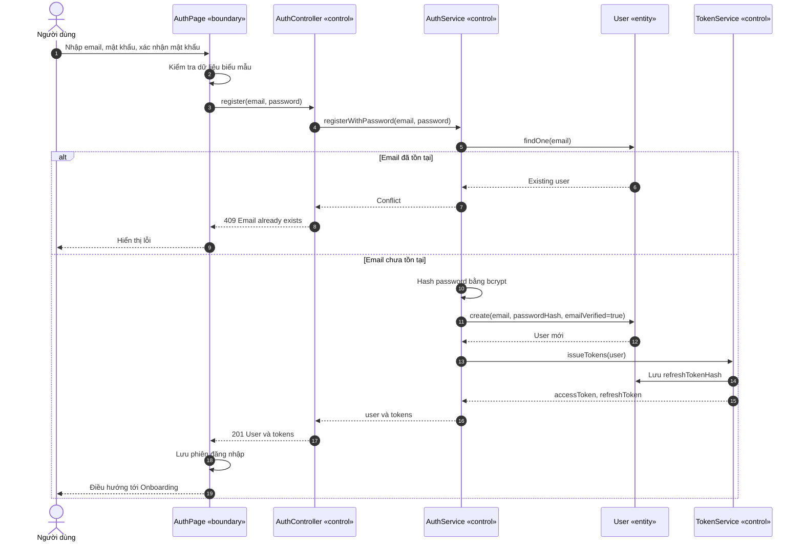

## SD-02 — Đăng nhập thống nhất cho mọi vai trò

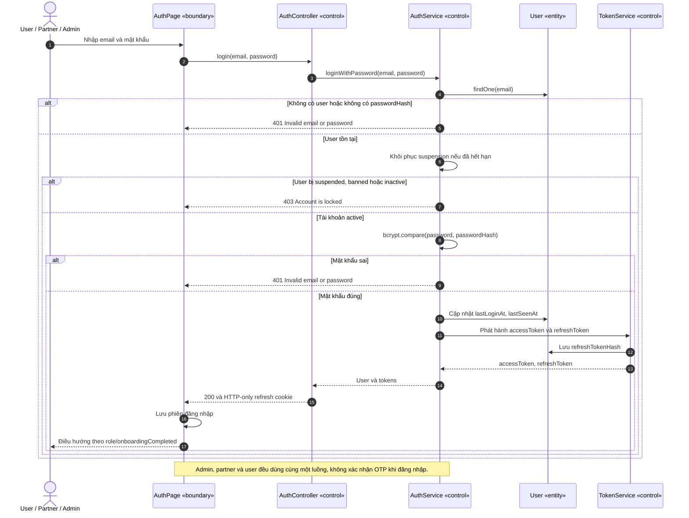

## SD-03 — Quên và đặt lại mật khẩu

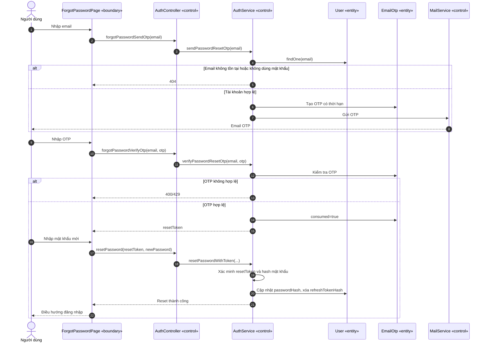

## SD-04 — Hoàn thành onboarding và thiết lập vị trí

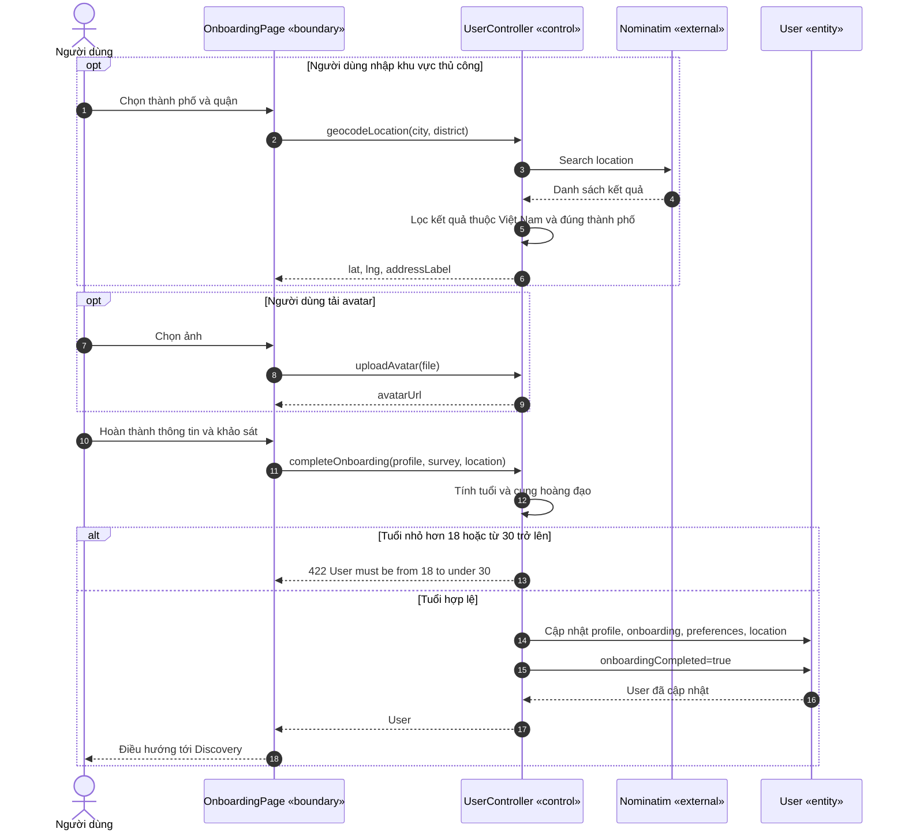

## SD-05 — Lấy Discovery Feed và like/pass

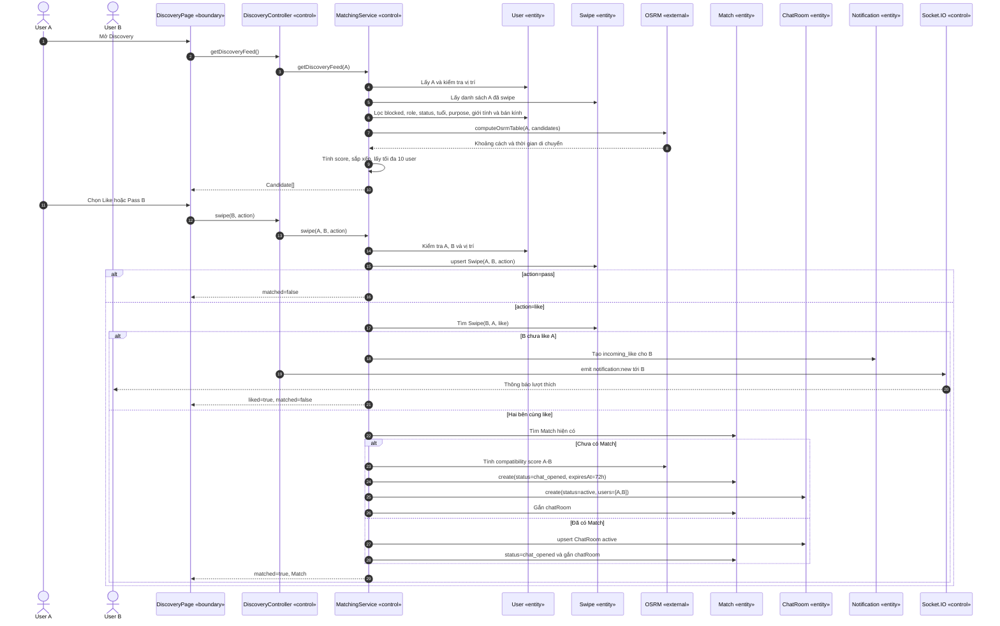

## SD-06 — Đề xuất và xác nhận quán

Luồng này vẫn tồn tại, nhưng mutual like đã mở chat trước. Khi A chọn quán, hệ thống thực tế đổi `Match` từ `chat_opened` về `cafe_proposed`; sau khi B xác nhận mới đổi lại `chat_opened`.

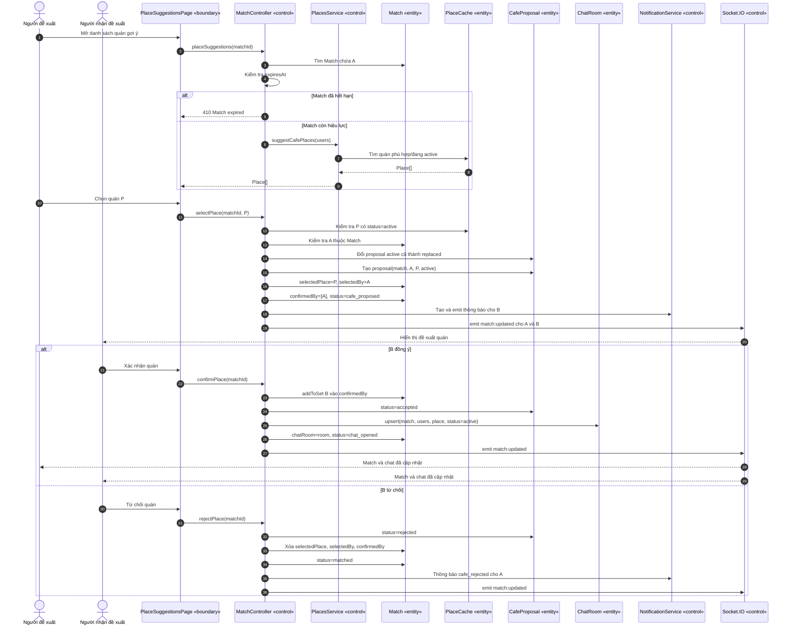

## SD-07 — Chat cá nhân realtime

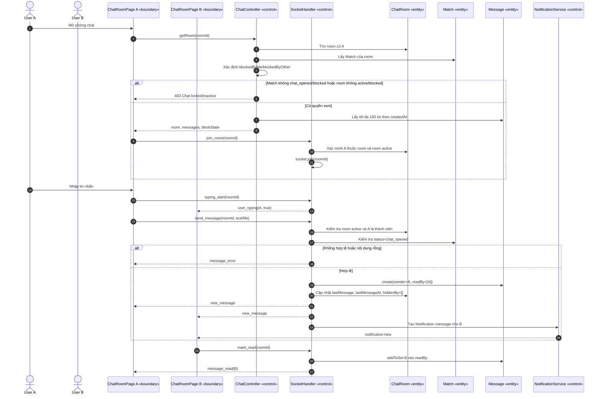

## SD-08 — Quản lý nhóm và chat nhóm

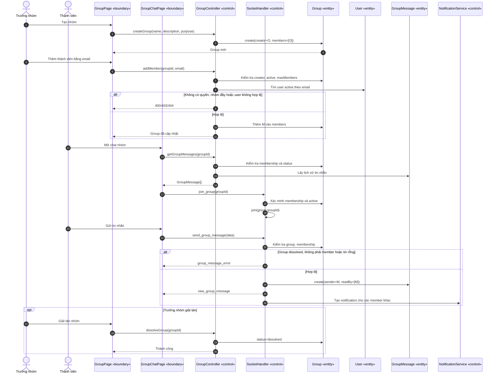

## SD-09 — Báo cáo và block người dùng

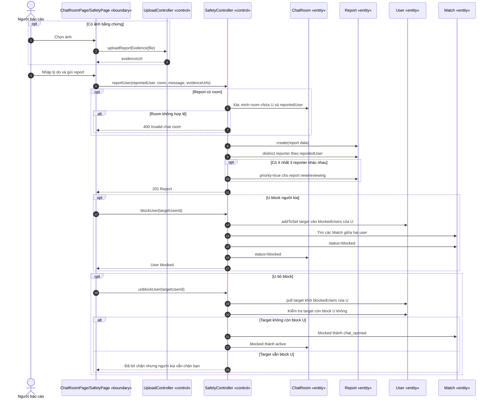

## SD-10 — Admin xử lý báo cáo

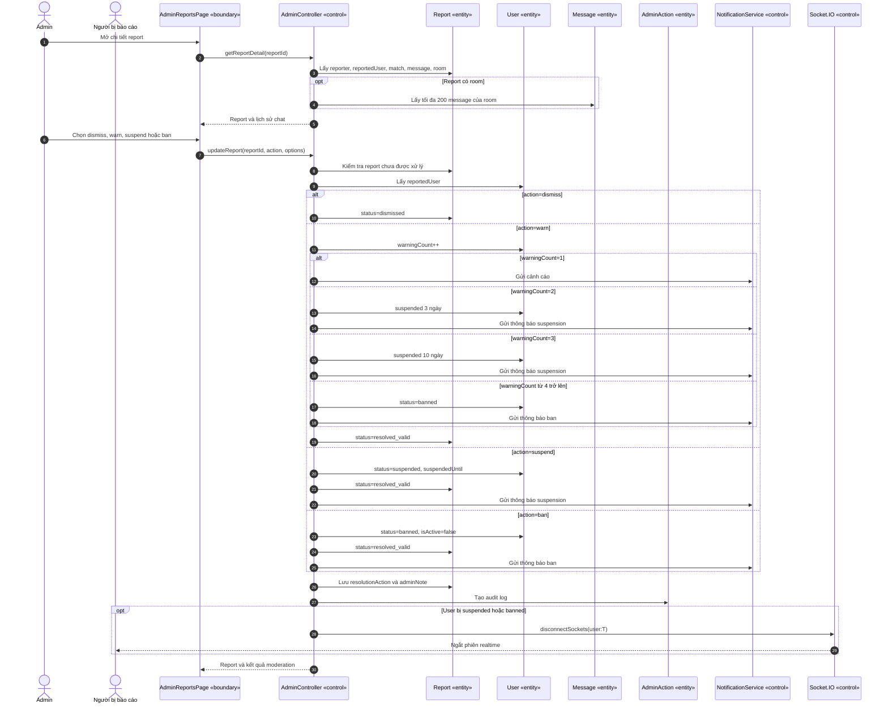

## SD-11 — Partner đăng ký quán và admin duyệt

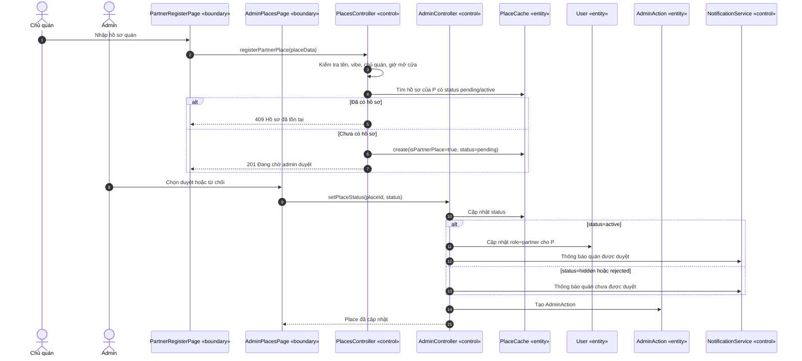

## SD-12 — Partner tạo voucher và người dùng lưu voucher

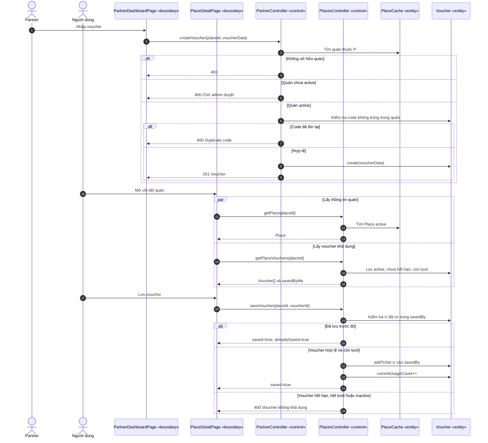

## Kết luận về luồng thật

Luồng hiện tại **không còn tuân thủ Cafe-Gated Chat**. `MatchingService.swipe()` mở `ChatRoom` ngay khi mutual like. Chức năng chọn quán vẫn tồn tại và thậm chí đổi một match đang `chat_opened` thành `cafe_proposed`, làm chat bị khóa trở lại cho đến khi người còn lại xác nhận. Đây là mâu thuẫn nghiệp vụ trong implementation, không phải cách diễn giải của sơ đồ.
