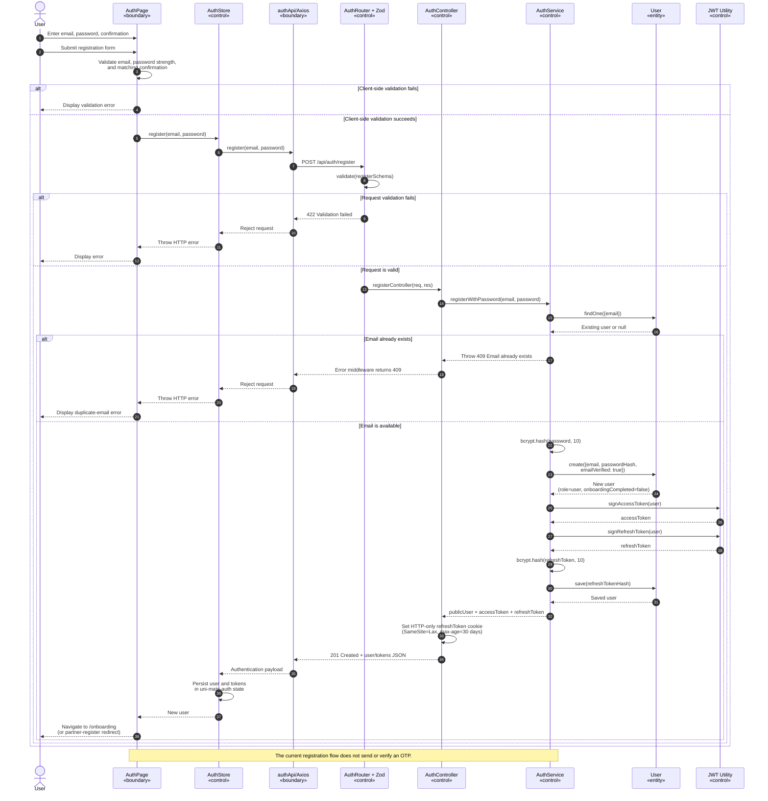
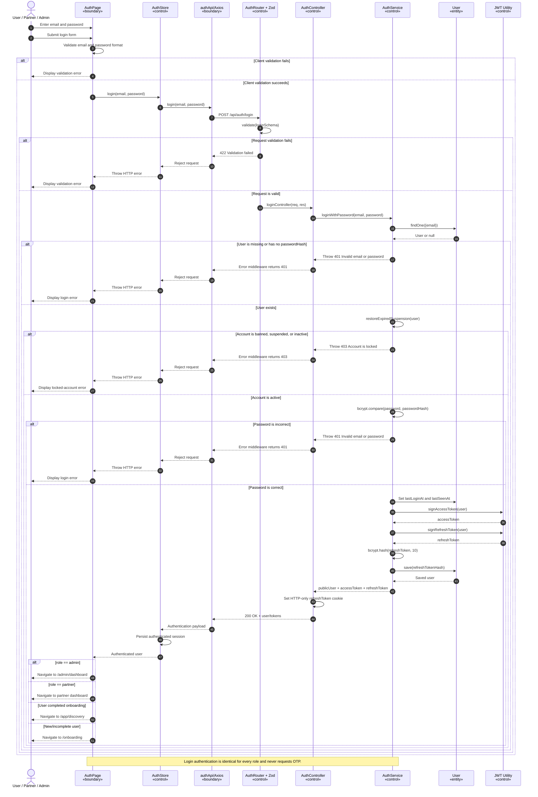

# UNI-MATE — UML Sequence Diagrams for Authentication

These diagrams describe the behavior implemented by the current frontend and backend code.

## 1. Account registration

## 2. Login

## 3. Forgot password

```mermaid
sequenceDiagram
    autonumber
    actor U as User
    participant UI as ForgotPasswordPage<br/>«boundary»
    participant API as authApi/Axios<br/>«boundary»
    participant R as AuthRouter + Zod<br/>«control»
    participant C as AuthController<br/>«control»
    participant S as AuthService<br/>«control»
    participant DB as User<br/>«entity»
    participant OTP as EmailOtp<br/>«entity»
    participant MAIL as SMTP Email Service<br/>«external»
    participant JWT as JWT Utility<br/>«control»

    Note over U,JWT: Step 1 — Request password-reset OTP
    U->>UI: Enter registered email
    UI->>UI: Validate email format
    UI->>API: sendPasswordResetOtp(email)
    API->>R: POST /api/auth/forgot-password/send-otp
    R->>R: validate(forgotPasswordSendOtpSchema)
    R->>C: forgotPasswordSendOtpController
    C->>S: sendPasswordResetOtp(email)
    S->>DB: findOne({email})
    DB-->>S: User or null

    alt User is missing or has no passwordHash
        S-->>C: Throw 404
        C-->>API: Error middleware returns 404
        API-->>UI: Reject request
        UI-->>U: Display email/account error
    else Password account exists
        S->>OTP: Check resend cooldown and hourly quota
        alt Cooldown/quota reached or production SMTP missing
            S-->>C: Throw 429 or 500
            C-->>API: Error response
            API-->>UI: Reject request
            UI-->>U: Display OTP-send error
        else OTP may be sent
            S->>S: Generate six-digit OTP<br/>and bcrypt.hash(OTP, 10)
            S->>OTP: create({email, otpHash, expiresAt,<br/>attempts=0, consumed=false})
            S->>MAIL: sendOtpEmail(email, OTP)
            MAIL-->>S: Send result
            S-->>C: OTP sent
            C-->>API: 200 OK
            API-->>UI: Success
            UI->>UI: step = "otp"
            UI-->>U: Display OTP entry form
        end
    end

    Note over U,JWT: Step 2 — Verify OTP and obtain a short-lived reset token
    U->>UI: Enter six-digit OTP
    UI->>UI: Validate /^\d{6}$/
    UI->>API: verifyPasswordResetOtp(email, OTP)
    API->>R: POST /api/auth/forgot-password/verify-otp
    R->>R: validate(forgotPasswordVerifyOtpSchema)
    R->>C: forgotPasswordVerifyOtpController
    C->>S: verifyPasswordResetOtp(email, OTP)
    S->>OTP: Find newest unconsumed,<br/>unexpired EmailOtp
    OTP-->>S: OTP record or null

    alt OTP missing, expired, or attempts exhausted
        S-->>C: Throw 400 or 429
        C-->>API: Error response
        API-->>UI: Reject request
        UI-->>U: Display OTP error
    else OTP record is usable
        S->>S: bcrypt.compare(input, otpHash)
        alt OTP is incorrect
            S->>OTP: Increment attempts and save
            S-->>C: Throw 400
            C-->>API: Error response
            API-->>UI: Reject request
            UI-->>U: Display OTP error
        else OTP is correct
            S->>DB: findOne({email}) and recheck account state
            alt Account is missing, locked, or inactive
                S-->>C: Throw 404 or 403
                C-->>API: Error response
                API-->>UI: Reject request
                UI-->>U: Display account error
            else Account is eligible
                S->>OTP: Set consumed=true and save
                S->>JWT: signPasswordResetToken(user)<br/>purpose=password_reset, expires in 10m
                JWT-->>S: resetToken
                S-->>C: resetToken
                C-->>API: 200 OTP verified + resetToken
                API-->>UI: resetToken
                UI->>UI: Store token in component state<br/>and set step = "password"
                UI-->>U: Display new-password form
            end
        end
    end

    Note over U,JWT: Step 3 — Set the new password
    U->>UI: Enter and confirm new password
    UI->>UI: Validate strength and equality
    UI->>API: resetPassword(resetToken,<br/>newPassword, confirmPassword)
    API->>R: POST /api/auth/forgot-password/reset
    R->>R: validate(resetPasswordSchema)

    alt Request validation fails
        R-->>API: 422 Validation failed
        API-->>UI: Reject request
        UI-->>U: Display password error
    else Request is valid
        R->>C: resetPasswordController
        C->>S: resetPasswordWithToken(resetToken, newPassword)
        S->>JWT: verifyPasswordResetToken(resetToken)

        alt Token is invalid, expired, or has wrong purpose
            JWT-->>S: Verification error
            S-->>C: Throw 401
            C-->>API: Error response
            API-->>UI: Reject request
            UI-->>U: Ask for a new OTP
        else Token is valid
            JWT-->>S: {userId, email, purpose}
            S->>DB: findById(userId) and verify email/account state
            alt Account is missing, locked, or inactive
                S-->>C: Throw 404 or 403
                C-->>API: Error response
                API-->>UI: Reject request
                UI-->>U: Display account error
            else Account is eligible
                S->>S: bcrypt.compare(newPassword, old passwordHash)
                alt New password equals old password
                    S-->>C: Throw 400
                    C-->>API: Error response
                    API-->>UI: Reject request
                    UI-->>U: Ask for a different password
                else New password is different
                    S->>S: bcrypt.hash(newPassword, 10)
                    S->>DB: Set passwordHash, unset refreshTokenHash,<br/>and save
                    DB-->>S: Updated user
                    S-->>C: Password changed
                    C-->>API: 200 OK
                    API-->>UI: Success
                    UI-->>U: Show success message
                    UI-->>U: After 900 ms, navigate to /auth
                end
            end
        end
    end

    Note over UI,DB: Reset does not create a login session. Existing refresh token is invalidated in DB.
    Note over UI,DB: previously issued access tokens remain valid until their normal expiration.
```

## Implementation notes

- Registration creates `emailVerified: true` and issues tokens immediately; it does not use OTP.
- Every role logs in with the same email/password flow; login no longer uses OTP or 2FA.
- Password reset uses the shared `EmailOtp` collection and shared OTP email sender.
- A successful password reset clears `refreshTokenHash` and returns the user to `/auth`; it does not issue new tokens.
