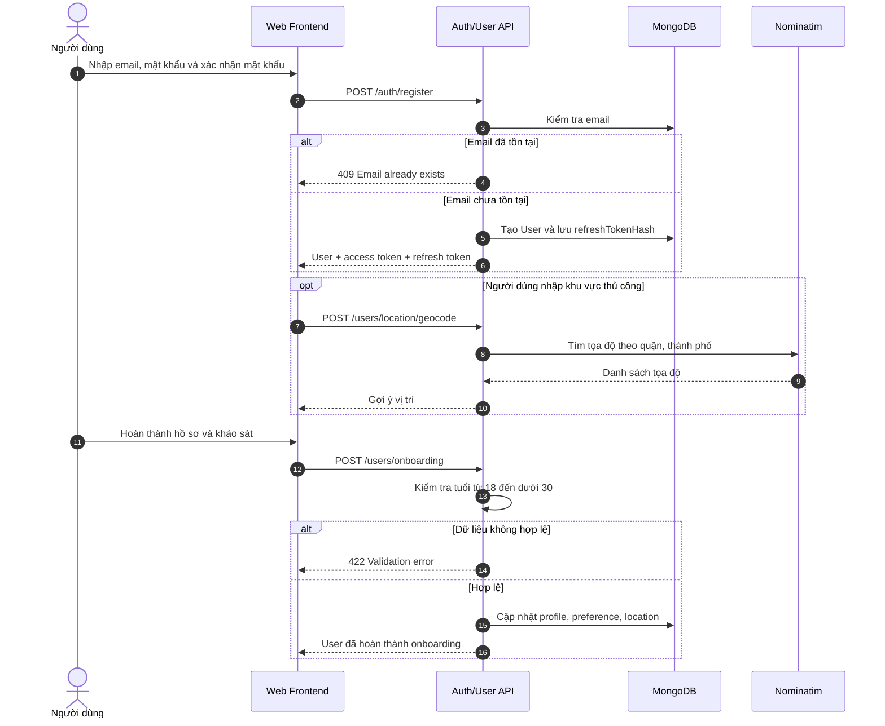
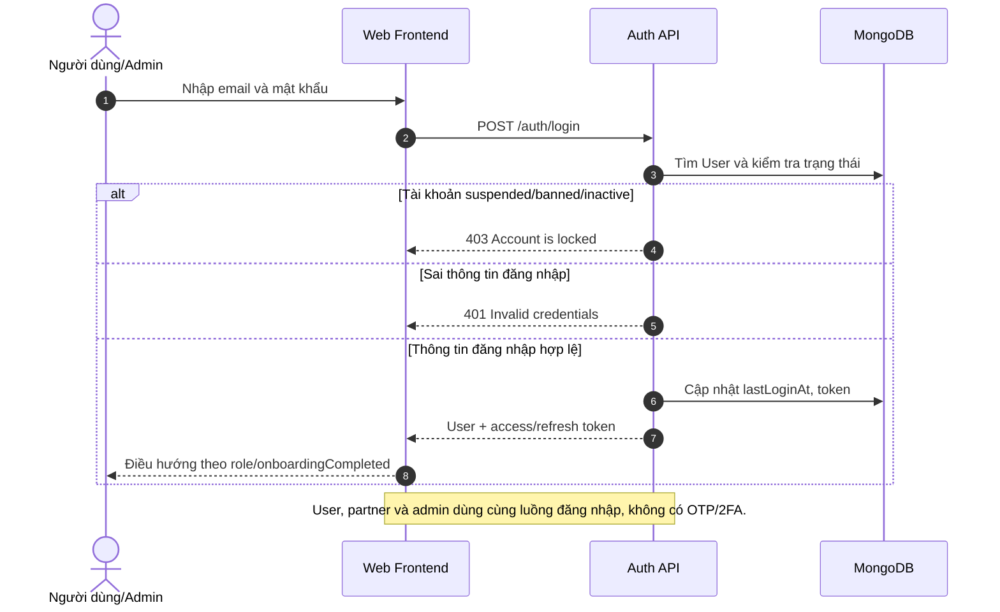
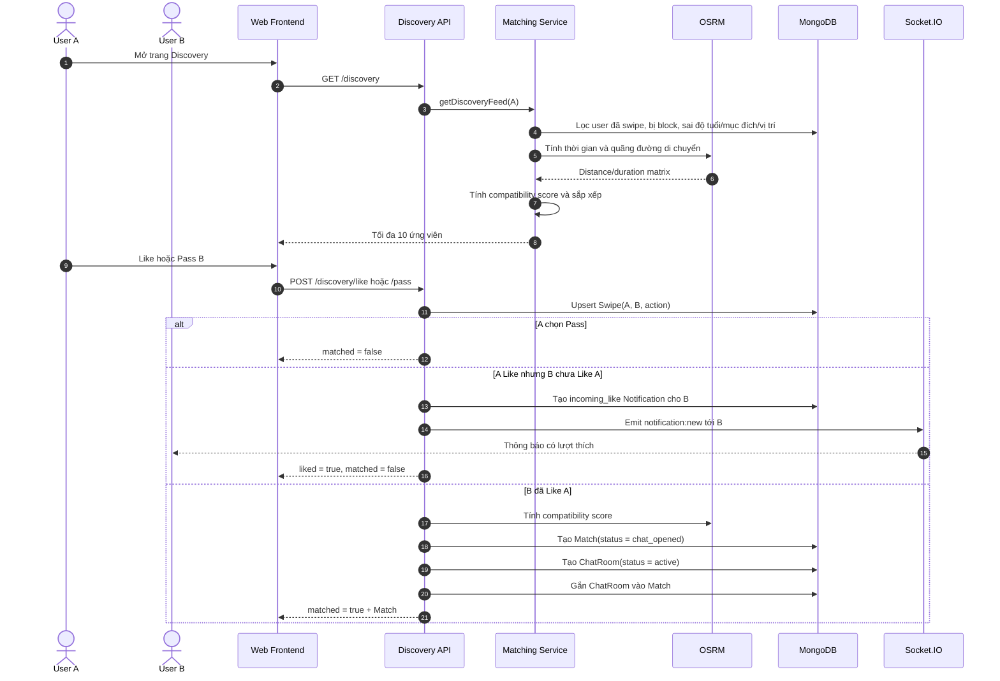
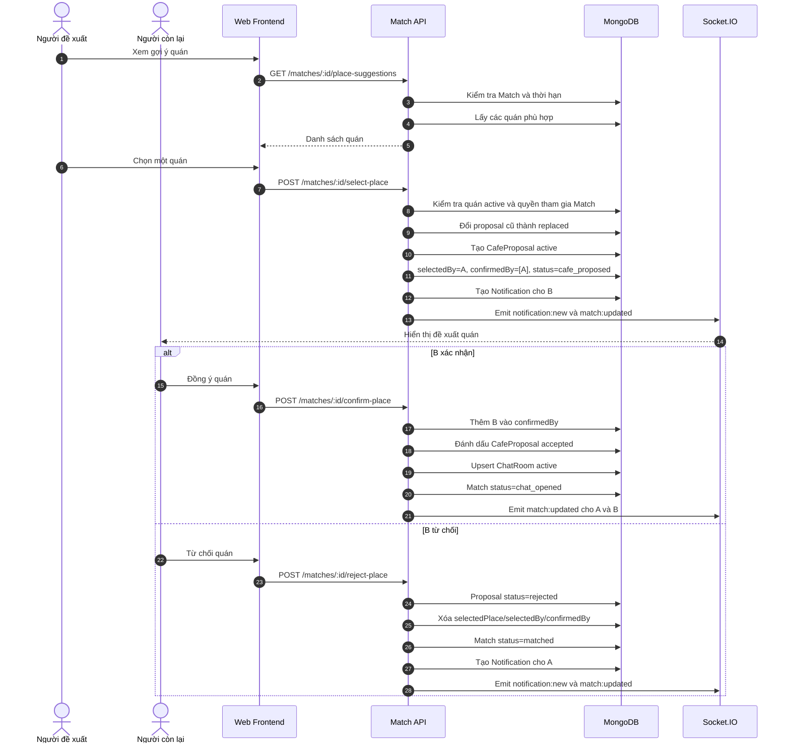
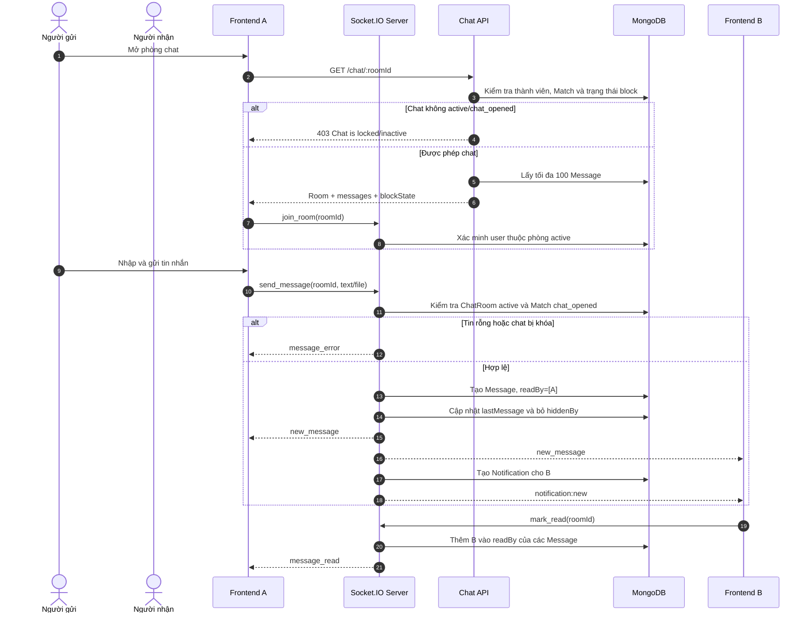
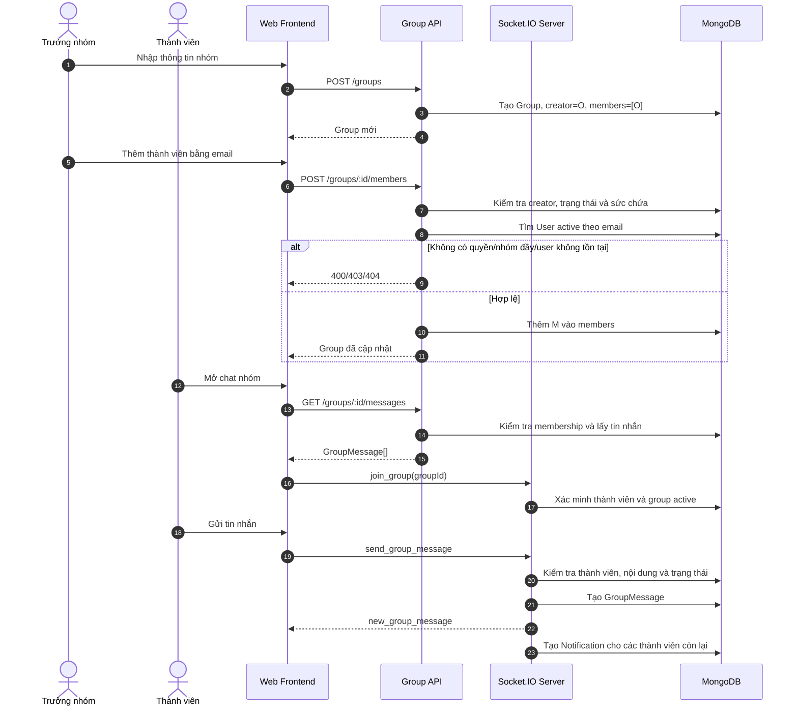
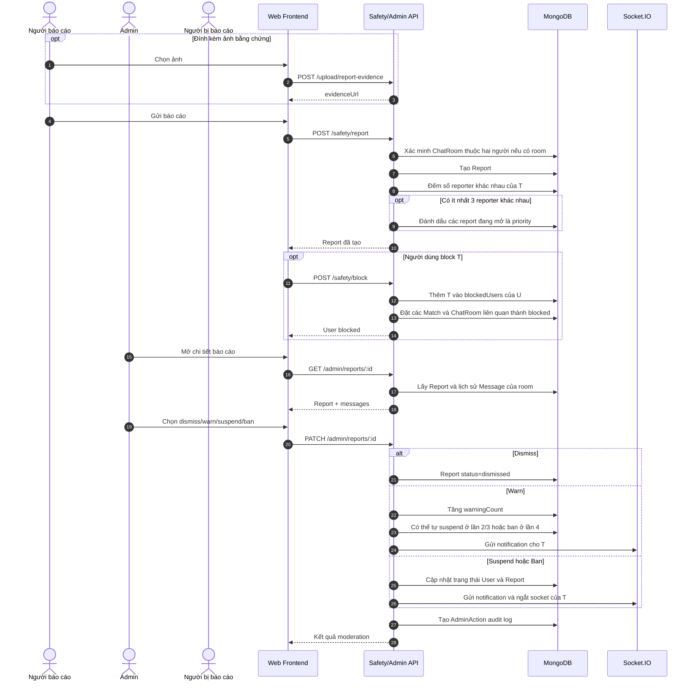
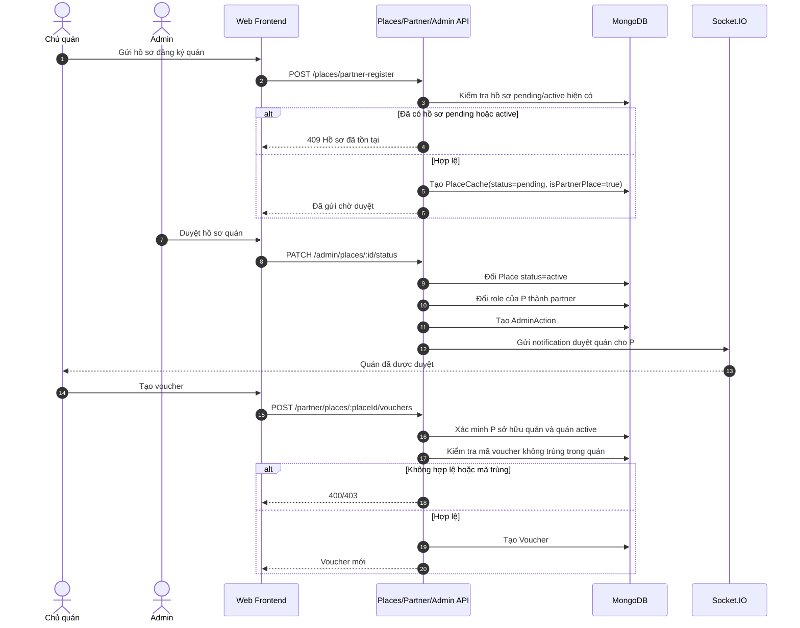
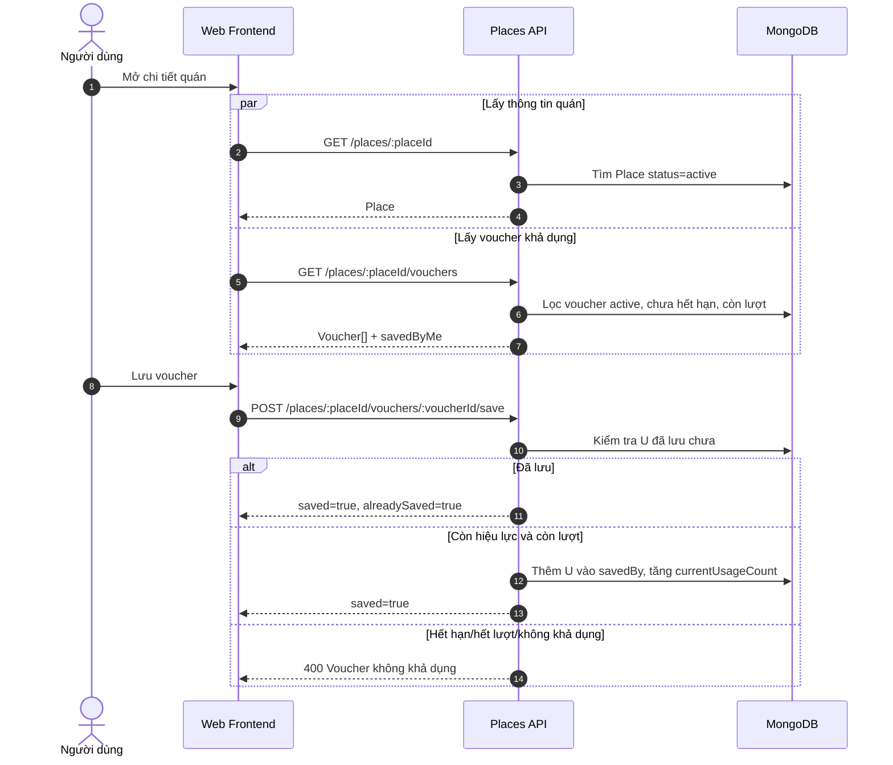

# UNI-MATE Sequence Diagrams

> Tài liệu này là bản khái quát ban đầu. Bản UML theo đúng luồng implementation hiện tại nằm tại [actual-uml-sequence-diagrams.md](./actual-uml-sequence-diagrams.md). Bản UML mới là nguồn nên sử dụng cho báo cáo.

Các sơ đồ dưới đây phản ánh luồng đang được cài đặt trong backend và frontend hiện tại.

## 1. Đăng ký tài khoản và hoàn thành onboarding

## 2. Đăng nhập thống nhất cho mọi vai trò

## 3. Discovery, like/pass và tạo match

> Lưu ý: implementation hiện tại mở chat ngay khi mutual like, chưa chờ xác nhận quán.

## 4. Đề xuất, xác nhận hoặc từ chối quán

## 5. Chat cá nhân realtime

## 6. Tạo nhóm, quản lý thành viên và chat nhóm

## 7. Báo cáo, block và xử lý của admin

## 8. Partner đăng ký quán, admin duyệt và tạo voucher

## 9. Người dùng xem và lưu voucher

## Sai khác nghiệp vụ cần xử lý

README mô tả quy tắc **Cafe-Gated Chat**: chỉ mở chat sau khi cả hai xác nhận cùng một quán. Tuy nhiên `matching.service.ts` hiện tạo `Match` với `status = chat_opened` và tạo `ChatRoom` ngay khi mutual like. Vì vậy sequence số 3 phản ánh code đang chạy, còn sequence số 4 phản ánh API xác nhận quán vẫn tồn tại nhưng không còn thực sự là cổng bắt buộc trước chat.
